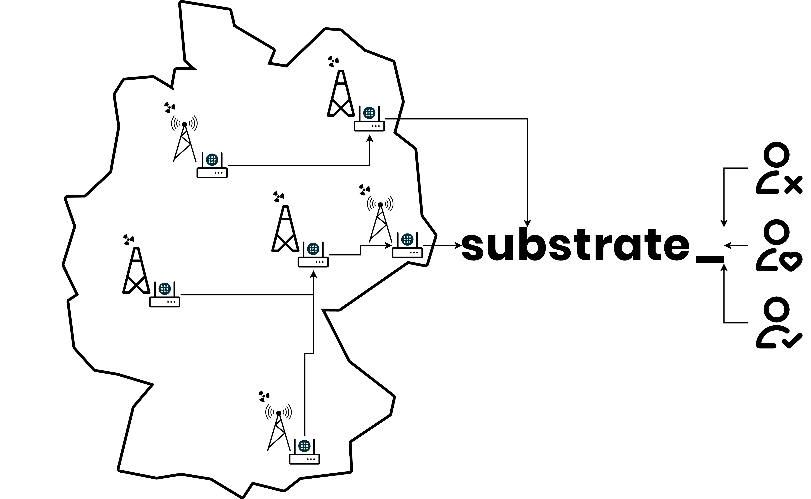
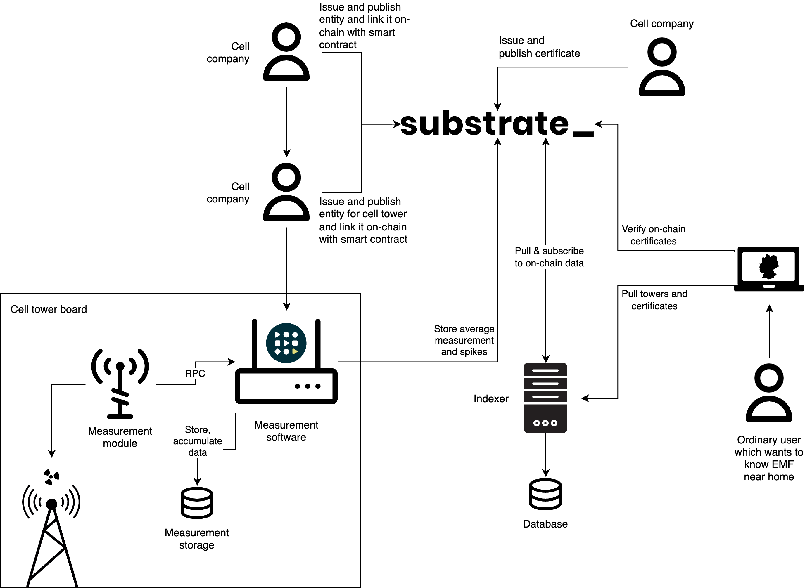

# EMF

The goal of this project is to digitize and automate certification of cell towers’ compliance with regulations related to electromagnetic field (EMF) radiation levels.

Proliferation of mobile 4G and 5G networks increased people’s concerns about the negative influence of these networks on people’s health. As a result European policy makers created regulations that limit the maximum level of EMF radiation produced by wireless antennas. Since a cell tower usually hosts multiple antennas, the EMF compliance certification lies on the shoulders of cell tower companies. The current certification process is mostly manual and involves subcontractors going to each tower and making measurements using specialized equipment. This is inefficient in terms of time and money especially when you need to repeat the certification periodically, i.e. when the new antennas are mounted on the tower.

We want to automate this process using industry-grade EMF sensors that save their measurements in the blockchain. The sensors are perpetually mounted on the towers and are connected to the single-board computer that periodically (e.g. once a day/month, after each new antenna is installed etc.) sends the data to the blockchain.

Within the smart contracts we would like to store each cell company and their cell towers on-chain and link with them EMF measurements which will be stored on-chain too. From time to time we would like to issue on-chain certificates which will be based on EMF measurements. These certificates can be included into the official documents that the cell tower company submits to the regulatory authorities.

We partner with a cell tower company that is particularly interested in reducing the operational costs associated with EMF certification. The automation of this process via blockchain would substantially reduce these costs.

---

---

---

**[Flow](./docs/render/Flow.svg)**

EMF - electromagnetic field.

Useful links about regulation:
- https://single-market-economy.ec.europa.eu/sectors/electrical-and-electronic-engineering-industries-eei/radio-equipment-directive-red_en
- https://www.sgs.com/en/news/2023/01/cc-2022-q4-finding-the-best-way-to-demonstrate-compliance-with-cybersecurity-regulations
- https://www.tuvsud.com/en/resource-centre/stories/new-eu-security-legislation-under-radio-equipment-directive

Our initial idea is to develop special measurement software in Rust which can be run on IoT devices. This software will accumulate data from the measurement module and store it on-chain using smart contracts. Using stored measurement we can issue on-chain certificates for cell towers companies through the smart contract.
