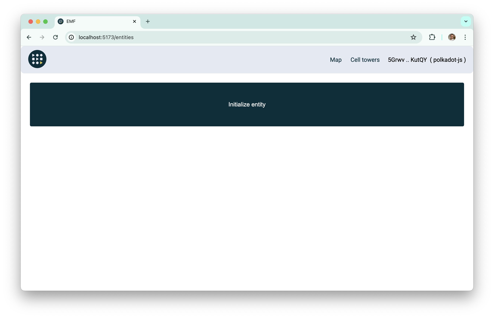
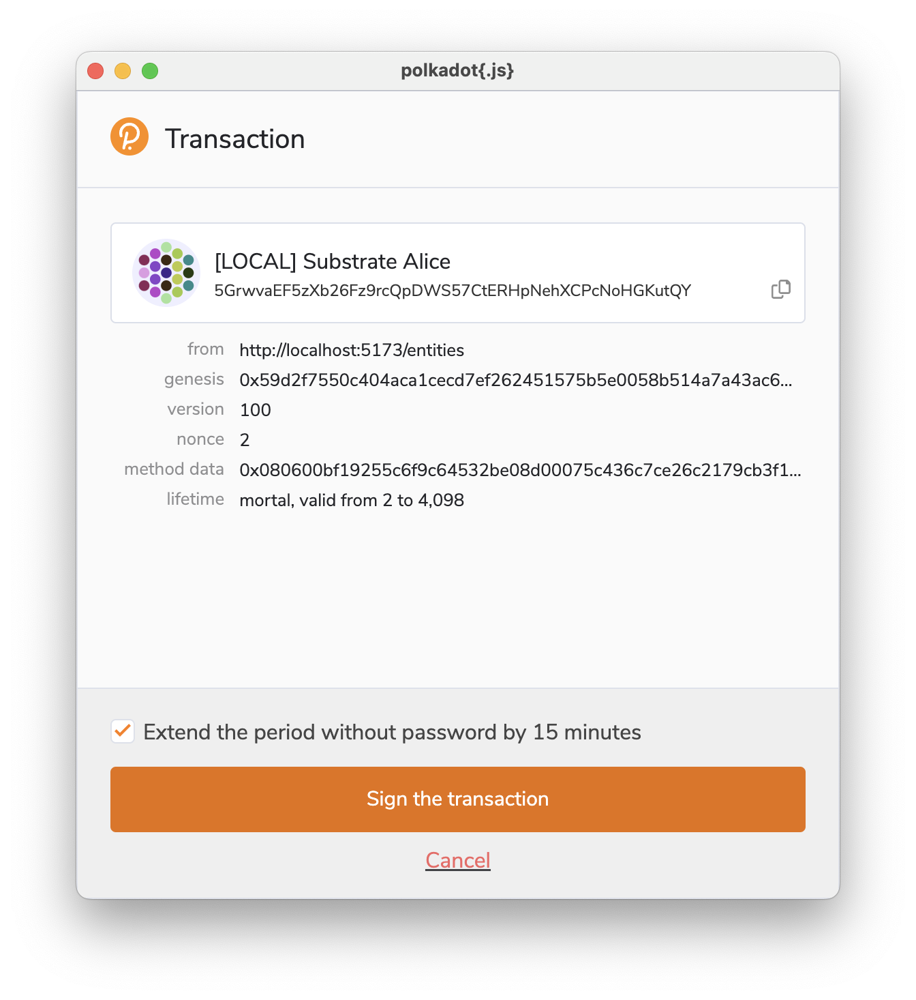
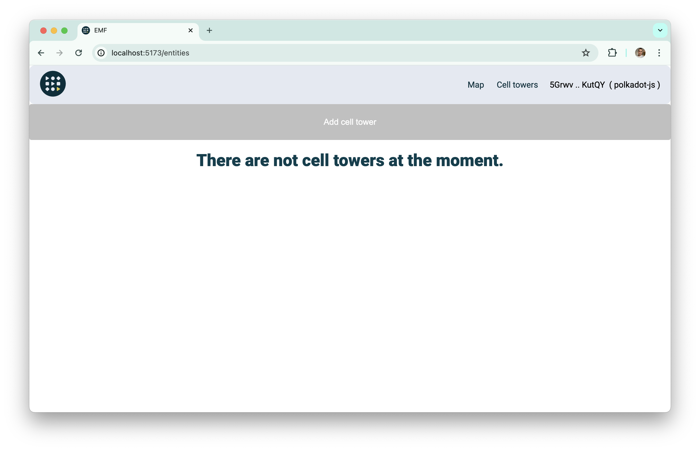

# Cell company initialization

To initialize cell company you firstly need to [connect your wallet](./connect-wallet.md).

After that you can go to `/entities` page and you can see `Initialize` button. If you do not see it it means your entity is already initialized.

After clicking on this button you will be promoted to sign the transaction.

And after successfully executed smart contract you can see following page.

It means you successfully initialized your entity (cell company).
