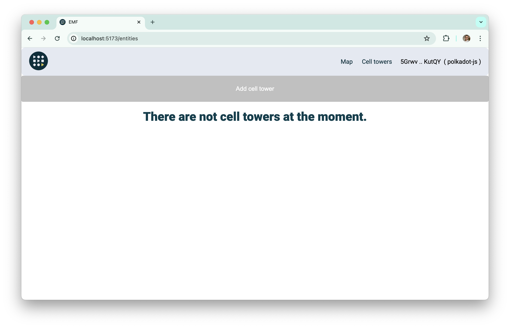
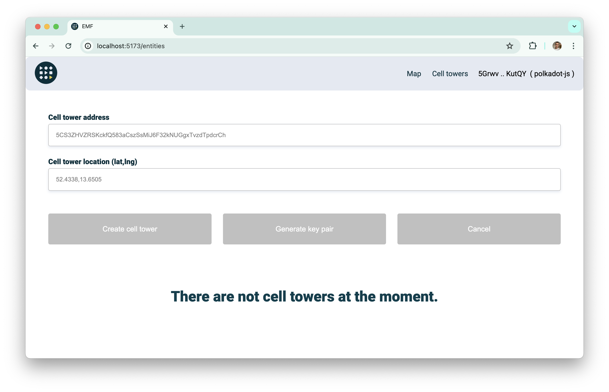
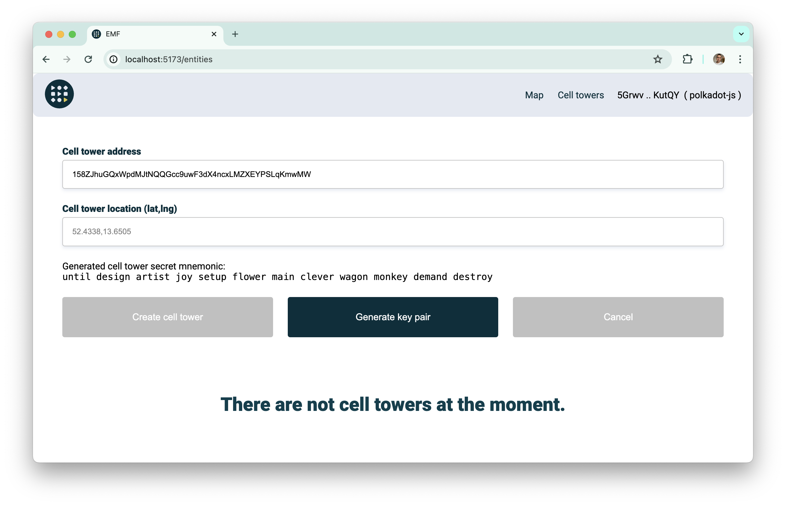
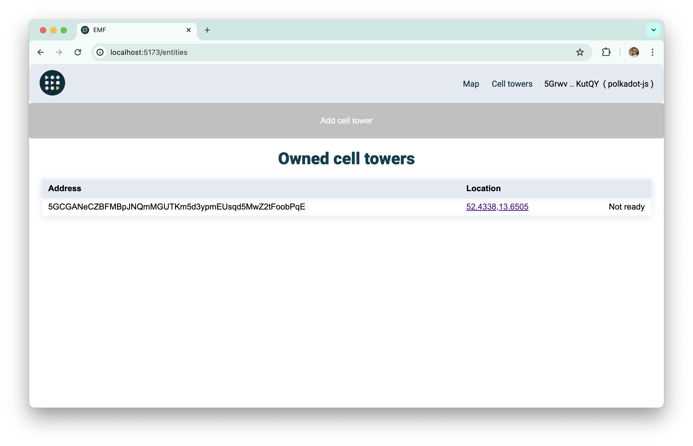
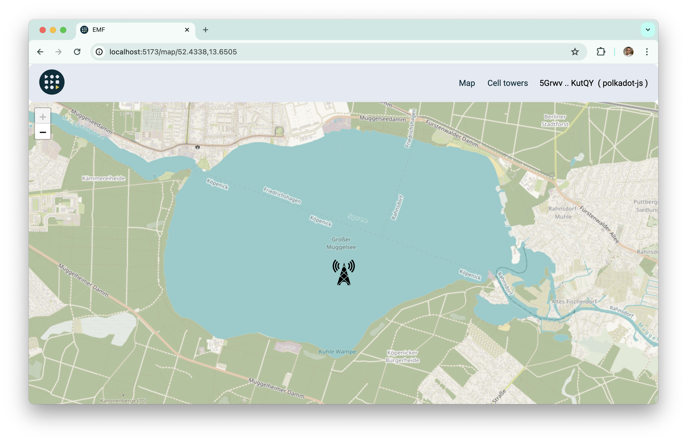
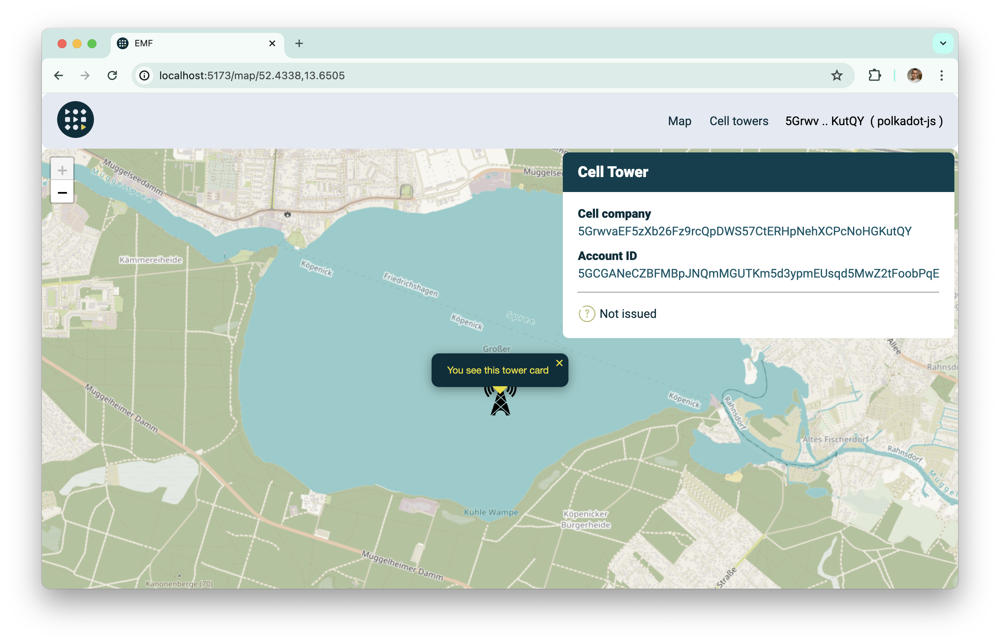

# Cell tower creation and linking

To create and link cell tower you firstly need to [connect your wallet](./connect-wallet.md).

On the `Cell towers` page you can see `Add cell tower` button.

You can click on this button and see new cell tower creation form.

You can use your own address our generate new one by pressing `Generate key pair`.

After generation you can see that `Cell tower address` is filled and there is a private phrase for the wallet itself.

By clicking on `Create cell tower` button you will be promoted to sign the transaction. After successful creation you can see alert about it and new cell tower in the table.

You can click on the entity address and you will be moved to the map to see its precise location.

You can click on this tower and see that certificate is not found because it is not issued.

