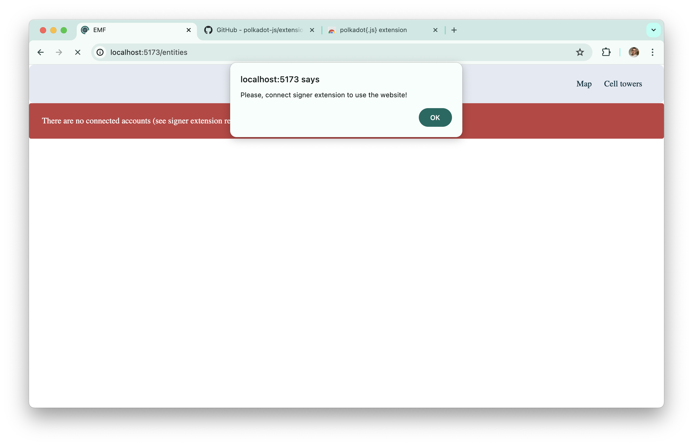
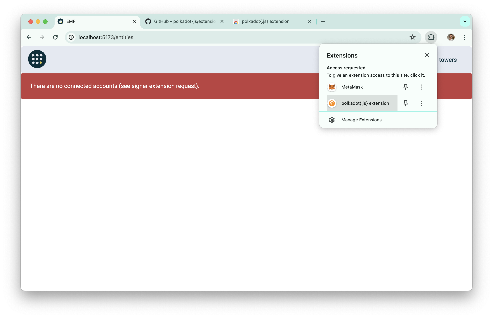
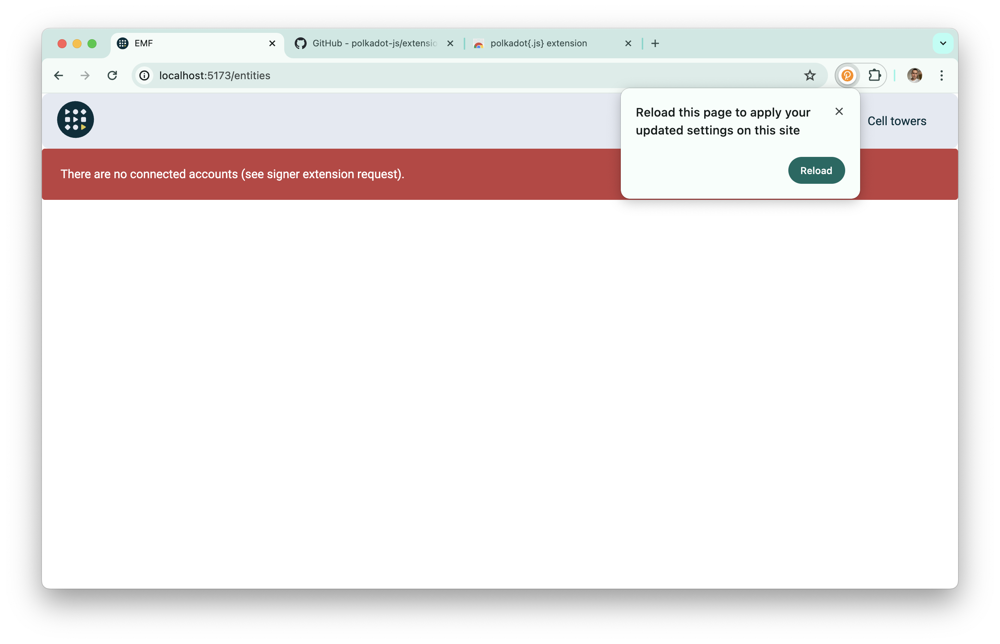
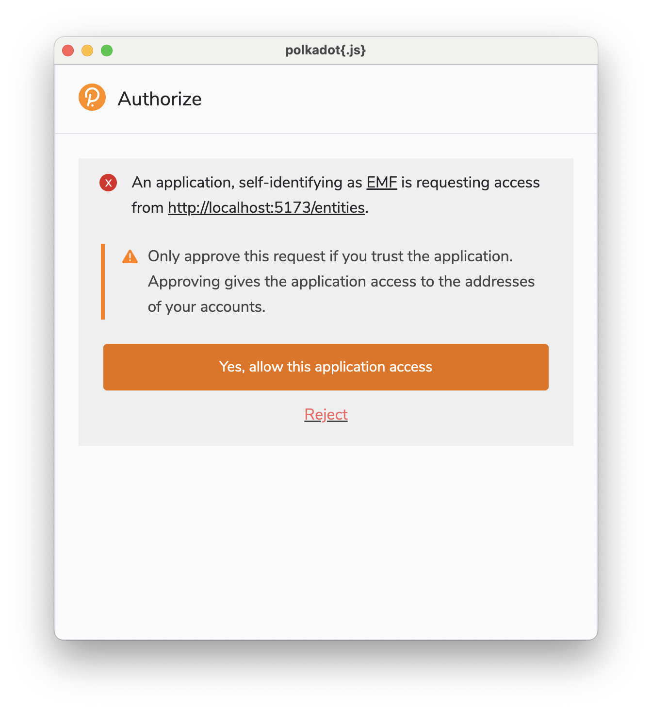
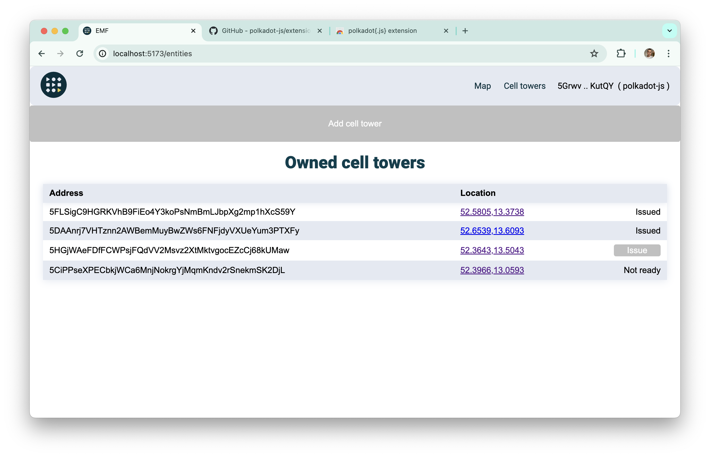

# Connect wallet

We recommend to use this extension: [polkadot{.js}](https://github.com/polkadot-js/extension)

Before connection you will see this alert and a message that extension and wallet are not enabled and connected.

So you need to open a modal with extensions and enable extension.

After that you need to reload page.

And connect your wallet.

After that you can use this page.

