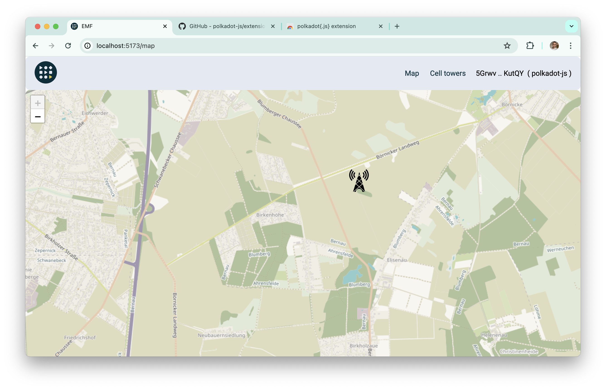
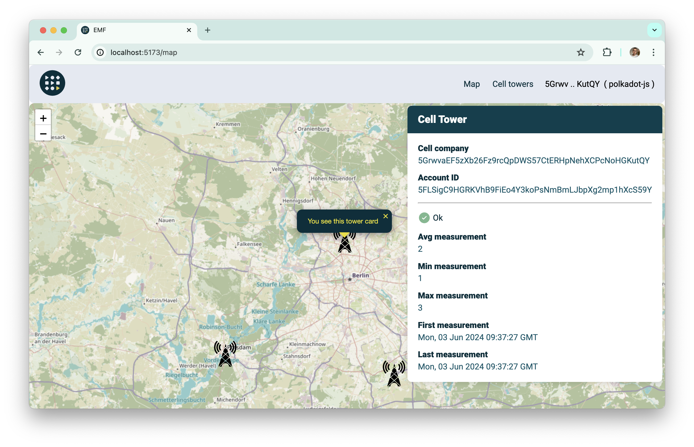
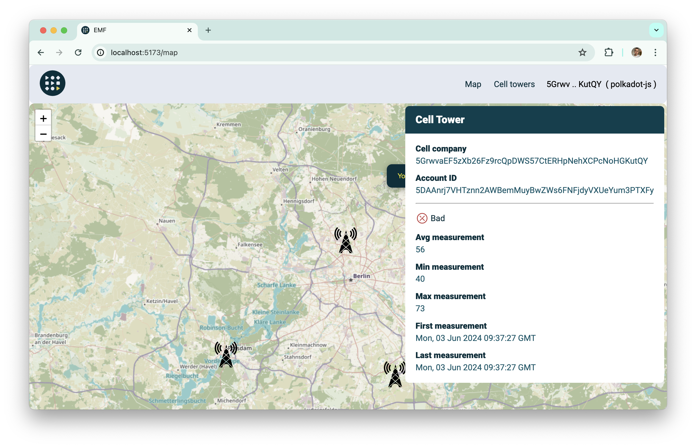
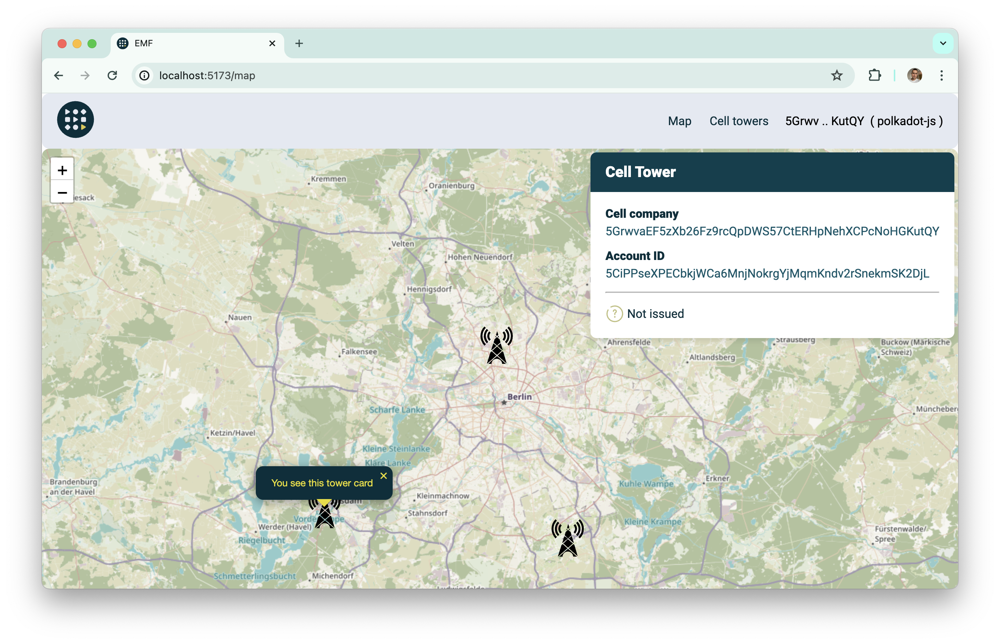

# How to use map

On the map you can find different cell towers and their certificates to check their measurements and spikes.

When you open a page with a map you can see some cell towers.

You can play with zoom to find particular regions or cell tower.

By clicking on the cell tower you can see its certificates.

