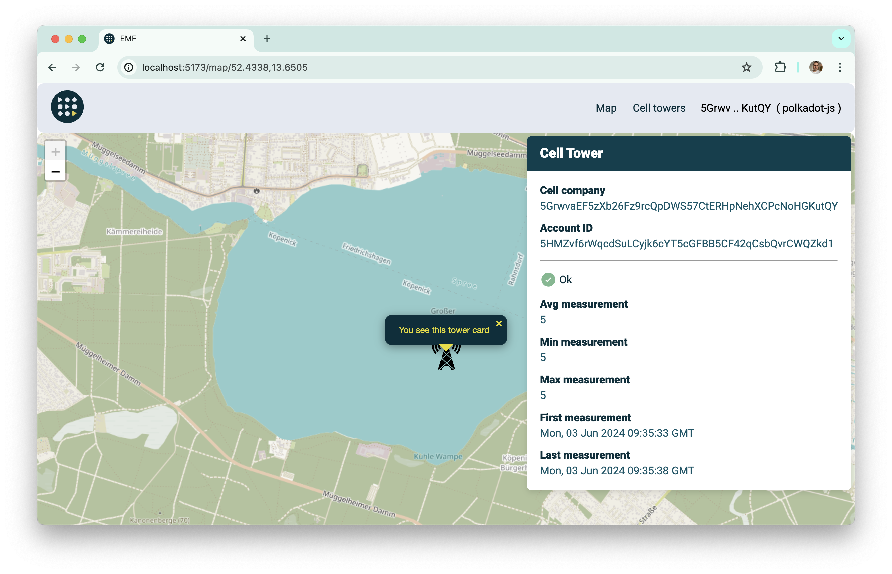

# Issue certificate

To issue new certificate for the cell tower you firstly need to [connect your wallet](./connect-wallet.md).

After that you can see your cell towers and their certificate status. For example we have one cell tower without issued certificate.

And same cell tower on the map.

After clicking by `Issue` button in the cell towers table you will be promoted to sign the transaction. After successful smart contract executing you will issue new certificate for your cell tower.

You can see that now status is 'Issued'.

And we can check certificate details on the map.

